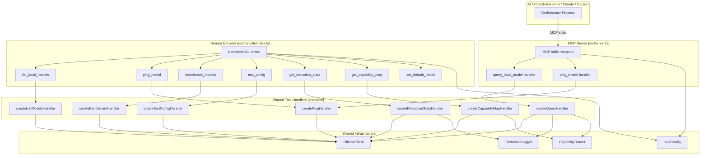

# Design Document: Dual Console Separation

## Overview

The `dual-console-separation` feature splits the ollama-mcp-bridge into two distinct runtime interfaces:

1. **MCP Server** (`src/server.ts`) — stripped to expose only `query_local_model` and `ping_model` to AI orchestrators via the MCP stdio protocol.
2. **Human Console** (`src/console/index.ts`) — a new interactive CLI that the human operator runs directly to access all administrative tools: list models, ping model, set default model, run benchmarks, view configuration, view capability map, view reduction statistics, and run health checks.

The existing `bridge-setup` and `generate-config` CLIs are untouched. The existing TypeScript build (`npm run build`) compiles the console automatically because `tsconfig.json` already includes `src/**/*`.

### Design Rationale

The current server exposes 7 tools to AI orchestrators. Five of those (`benchmark_models`, `test_config`, `get_reduction_stats`, `get_capability_map`, `list_local_models`) are administrative — they exist for the human operator, not for the AI. Exposing them to the orchestrator creates noise in the tool list and a potential attack surface. Separating them into a dedicated human-facing CLI gives each audience exactly what it needs.

The Human Console reuses all existing tool handler factories (`createBenchmarkHandler`, `createTestConfigHandler`, etc.) directly — no logic is duplicated. The console is purely a presentation layer that wires up the same handlers to a terminal UI instead of the MCP protocol.

---

## Architecture



### Key Architectural Decisions

- **No logic duplication**: The console calls the same handler factories as the server. The handlers are pure functions of their dependencies — they don't care whether they're called from MCP or a CLI.
- **No new infrastructure**: The console uses `loadConfig()`, `OllamaClient`, `ReductionLogger`, `CapabilityRouter`, and all existing tool handlers as-is.
- **Minimal server changes**: `src/server.ts` only needs its `TOOL_DEFINITIONS` array and `CallTool` switch trimmed to two entries. All other server logic is unchanged.
- **No interactive library dependency**: The console uses Node.js built-in `readline` for interactive prompts to avoid adding a new runtime dependency.

---

## Components and Interfaces

### 1. Modified: `src/server.ts`

**Change**: Remove the five admin tool definitions from `TOOL_DEFINITIONS` and remove their corresponding `case` branches from the `CallTool` switch. Remove the five admin handler imports and instantiations.

**Preserved**: All startup logic, `query_local_model` and `ping_model` handlers, stdio transport, keepalive-on-start, progress notifier, and all configuration loading.

The `MethodNotFound` error for unknown tools is already handled by the `default` branch of the switch — no new code needed.

### 2. New: `src/console/index.ts`

The Human Console entry point. Responsibilities:

- Load config via `loadConfig()`
- Instantiate all shared dependencies (`OllamaClient`, `ReductionLogger`, `CapabilityRouter`, etc.)
- Instantiate all admin tool handlers via their factory functions
- Present an interactive menu loop using `readline`
- Dispatch to the appropriate handler based on user selection
- Format and print handler output to stdout
- Handle errors gracefully (display message, return to menu)
- Exit cleanly on user request

**Menu structure**:
```
ollama-mcp-bridge Console
─────────────────────────
1. List Models
2. Ping Model
3. Set Default Model
4. Run Benchmark
5. View Configuration
6. View Capability Map
7. View Reduction Stats
8. Test Configuration
9. Test Configuration (dry run)
0. Exit
```

### 3. New: `src/console/menu.ts` (optional helper)

A pure module that renders the menu string and maps numeric selections to action identifiers. Keeping this separate from `index.ts` makes it independently testable.

```typescript
export type MenuAction =
  | "list_models"
  | "ping_model"
  | "set_default_model"
  | "run_benchmark"
  | "view_config"
  | "view_capability_map"
  | "view_reduction_stats"
  | "test_config"
  | "test_config_dry"
  | "exit";

export function renderMenu(): string { ... }
export function parseSelection(input: string): MenuAction | null { ... }
```

### 4. New: `src/console/formatters.ts`

Pure formatting functions for console output. These are the primary targets for property-based testing.

```typescript
export function formatModelList(models: string[]): string
export function formatPingResult(model: string, result: PingResult): string
export function formatConfig(config: BridgeConfig): string
export function formatCapabilityMap(map: CapabilityMap, resolved?: { prompt: string; model: string }): string
export function formatReductionStats(stats: ReductionStats): string
export function formatCheckResults(checks: CheckResult[]): string
export function formatReductionRatio(ratio: number): string  // e.g. 0.312 → "31.2%"
```

All formatters are pure functions (no I/O), making them straightforward to test with property-based testing.

### 5. Modified: `package.json`

Add `"console"` script and `"bridge-console"` bin entry:

```json
{
  "scripts": {
    "console": "node dist/console/index.js"
  },
  "bin": {
    "generate-config": "dist/cli/generate_config.js",
    "bridge-setup": "dist/cli/setup.js",
    "bridge-console": "dist/console/index.js"
  }
}
```

---

## Data Models

No new persistent data models are introduced. The console reads from the same `BridgeConfig`, `ReductionStats`, `CapabilityMap`, and `CheckResult` types already defined in `src/types.ts` and the existing tool modules.

### Console Session State

The console maintains minimal in-memory session state:

```typescript
interface ConsoleSession {
  config: BridgeConfig;          // loaded once at startup; mutable for set_default_model
  ollamaClient: OllamaClient;
  reductionLogger: ReductionLogger;
  capabilityRouter: CapabilityRouter;
  // ... other handler dependencies
}
```

`set_default_model` mutates `config.defaultModel` and `process.env.OLLAMA_DEFAULT_MODEL` for the current session only. It does not persist to disk.

### Formatter Input/Output Contract

Each formatter in `src/console/formatters.ts` follows this contract:

| Formatter | Input | Output guarantee |
|---|---|---|
| `formatModelList` | `string[]` | Contains each model name on its own line |
| `formatPingResult` | `model: string, result: PingResult` | Contains model name, "warm"/"cold", response time in ms |
| `formatConfig` | `BridgeConfig` | Contains every field name and its string representation |
| `formatCapabilityMap` | `CapabilityMap, resolved?` | Contains every pattern→model pair; if resolved, contains resolved model name |
| `formatReductionStats` | `ReductionStats` | Contains totalInvocations, averageReductionRatio as %, totalTokensSaved; all byModel and byTaskType keys |
| `formatCheckResults` | `CheckResult[]` | Contains ✅/❌/⏭️ indicator for each check; failed checks include resolution hint |
| `formatReductionRatio` | `number` | Returns `(ratio * 100).toFixed(1) + "%"` |

---

## Correctness Properties

*A property is a characteristic or behavior that should hold true across all valid executions of a system — essentially, a formal statement about what the system should do. Properties serve as the bridge between human-readable specifications and machine-verifiable correctness guarantees.*

### Property 1: MCP server exposes exactly the two query tools

*For any* instantiation of the stripped MCP server, calling `ListTools` SHALL return an array containing exactly the names `"query_local_model"` and `"ping_model"` — no more, no fewer.

**Validates: Requirements 1.1, 1.2, 1.4**

---

### Property 2: MCP server rejects all non-query tool names

*For any* string that is not `"query_local_model"` or `"ping_model"`, calling `CallTool` with that name SHALL throw an `McpError` with `ErrorCode.MethodNotFound`.

**Validates: Requirements 1.3**

---

### Property 3: Every valid menu selection invokes a handler and produces output

*For any* valid menu selection index (1–9), selecting it SHALL invoke the corresponding handler and produce a non-empty string output before returning control to the menu loop.

**Validates: Requirements 2.4**

---

### Property 4: List models output contains all available model names

*For any* non-empty list of model names returned by `OllamaClient.listModels()`, the formatted output of the "List Models" action SHALL contain every model name from that list.

**Validates: Requirements 3.1**

---

### Property 5: Ping output contains status and response time

*For any* model name and any ping result (warm or cold, any response time in ms), the formatted output of the "Ping Model" action SHALL contain the model name, the warm/cold status string, and the numeric response time.

**Validates: Requirements 3.2**

---

### Property 6: Set default model updates the session default

*For any* non-empty model name string provided as input to "Set Default Model", after the action completes, `process.env.OLLAMA_DEFAULT_MODEL` SHALL equal that string.

**Validates: Requirements 3.3**

---

### Property 7: Benchmark report is displayed for any result

*For any* `BenchmarkReport` object (with any combination of successful and errored model results), the formatted benchmark output SHALL contain each model name from the report.

**Validates: Requirements 4.2, 4.4**

---

### Property 8: Config display contains all BridgeConfig fields and capability map entries

*For any* `BridgeConfig` object, the formatted configuration output SHALL contain every field name defined in `BridgeConfig` and every pattern→model entry in the `capabilityMap`.

**Validates: Requirements 5.1, 5.2**

---

### Property 9: Capability map resolve shows the resolved model

*For any* `CapabilityMap` and any prompt string, the "View Capability Map" action with a test prompt SHALL display the model name that `CapabilityRouter.resolveModel()` returns for that prompt.

**Validates: Requirements 5.4**

---

### Property 10: Reduction stats display contains all aggregate fields and breakdowns

*For any* `ReductionStats` object, the formatted stats output SHALL contain the total invocations count, the average reduction ratio formatted as a percentage, the total tokens saved, and every key from `byModel` and `byTaskType`.

**Validates: Requirements 6.1, 6.2**

---

### Property 11: Reduction ratio is formatted as a percentage

*For any* reduction ratio value `r` in the range `[0, 1]`, `formatReductionRatio(r)` SHALL return a string equal to `(r * 100).toFixed(1) + "%"`.

**Validates: Requirements 6.4**

---

### Property 12: Health check display shows correct indicators and lists all failures

*For any* array of `CheckResult` objects, the formatted health check output SHALL:
- Display `✅` for every PASS result
- Display `❌` for every FAIL result
- Display `⏭️` for every SKIPPED result
- Include the resolution hint for every FAIL result that has one
- List every failed check name in the summary when at least one check fails

**Validates: Requirements 7.2, 7.5**

---

## Error Handling

### MCP Server

- Unknown tool names: already handled by the existing `default: throw new McpError(ErrorCode.MethodNotFound, ...)` branch. No change needed.
- All other error handling in `query_local_model` and `ping_model` is unchanged.

### Human Console

| Scenario | Handling |
|---|---|
| Ollama unreachable (list models, ping, benchmark, test config) | Catch error, display `Error: <message>`, return to menu. Never crash. |
| Reduction log file missing | `ReductionLogger.readStats()` already returns empty stats — display "No stats available yet." |
| Invalid menu input | Display "Invalid selection, please try again." and re-prompt. |
| Benchmark model failure | `createBenchmarkHandler` already records `status: "ERROR"` per model and continues — the console displays the formatted report as-is. |
| `set_default_model` with empty input | Reject and re-prompt: "Model name cannot be empty." |
| Unexpected handler error | Catch, display `Unexpected error: <message>`, return to menu. |

### Readline / stdin handling

- The console uses `readline.createInterface({ input: process.stdin, output: process.stdout })`.
- On `SIGINT` (Ctrl+C), the readline interface emits `close` — the console treats this as an exit request and calls `process.exit(0)`.
- The `rl.close()` call in the exit action also triggers clean shutdown.

---

## Testing Strategy

### Unit Tests (example-based)

Located in `src/__tests__/unit/`:

- `console_menu.test.ts` — verify `renderMenu()` contains all 10 action labels; verify `parseSelection()` maps each valid input to the correct `MenuAction`; verify invalid inputs return `null`.
- `console_formatters.test.ts` — specific examples for each formatter: empty model list, single model, multiple models; warm vs cold ping; empty capability map; zero-invocation stats; all-pass vs all-fail health check.
- `server_tool_restriction.test.ts` — verify `TOOL_DEFINITIONS` array has exactly 2 entries; verify the `CallTool` switch has no cases for the 5 admin tools.

### Property-Based Tests (fast-check)

Located in `src/__tests__/property/`, using the existing `fast-check` library. Each test runs a minimum of 100 iterations.

| Test file | Property | fast-check arbitraries |
|---|---|---|
| `mcp_tool_list.property.test.ts` | Property 1: ListTools returns exactly 2 tools | N/A (deterministic) |
| `mcp_tool_rejection.property.test.ts` | Property 2: Non-query tool names rejected | `fc.string()` filtered to exclude the 2 allowed names |
| `console_menu_dispatch.property.test.ts` | Property 3: Valid selection invokes handler | `fc.integer({ min: 1, max: 9 })` |
| `format_model_list.property.test.ts` | Property 4: All model names appear in output | `fc.array(fc.string({ minLength: 1 }), { minLength: 1 })` |
| `format_ping.property.test.ts` | Property 5: Ping output contains status and time | `fc.record({ model: fc.string(), loaded: fc.boolean(), responseTimeMs: fc.nat() })` |
| `set_default_model.property.test.ts` | Property 6: Env var updated after set | `fc.string({ minLength: 1 })` |
| `format_benchmark.property.test.ts` | Property 7: All model names in benchmark output | `fc.array(fc.record({ model: fc.string(), ... }))` |
| `format_config.property.test.ts` | Property 8: All config fields and cap map entries in output | `fc.record(...)` matching BridgeConfig shape |
| `format_capability_map.property.test.ts` | Property 9: Resolved model appears in output | `fc.record({ map: ..., prompt: fc.string() })` |
| `format_reduction_stats.property.test.ts` | Property 10: All stats fields and breakdowns in output | `fc.record(...)` matching ReductionStats shape |
| `format_reduction_ratio.property.test.ts` | Property 11: Ratio formatted as percentage | `fc.float({ min: 0, max: 1 })` |
| `format_health_check.property.test.ts` | Property 12: Correct indicators and failure list | `fc.array(fc.record({ status: fc.constantFrom("PASS","FAIL","SKIPPED"), ... }))` |

**Tag format** (comment above each `it` block):
```
// Feature: dual-console-separation, Property N: <property_text>
```

### Integration / Smoke Tests

- Build smoke: `npm run build` produces `dist/console/index.js` — verified by CI.
- Backward compatibility: existing test suite (`npm test`) must continue to pass without modification.
- `package.json` structure: a simple assertion test verifies the `"console"` script and `"bridge-console"` bin entries exist.
