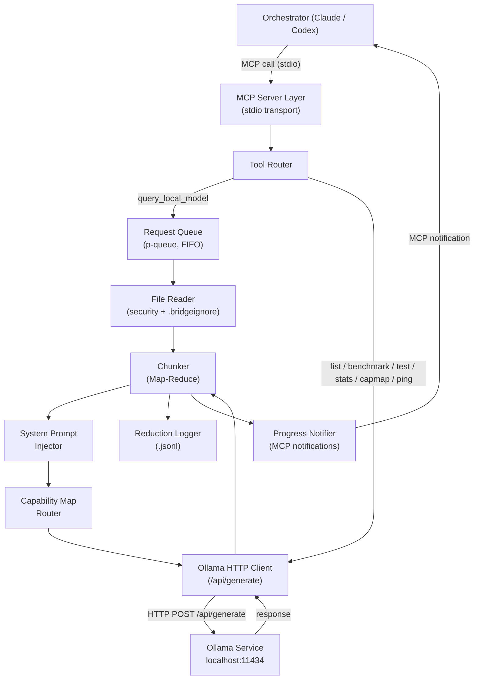

# Design Document: ollama-mcp-bridge

## Overview

The `ollama-mcp-bridge` is an MCP (Model Context Protocol) server that acts as an intelligent delegation bridge between a large orchestrating LLM (e.g., Claude, Codex) and a local model running in Ollama. Its primary purpose is to offload token-expensive or privacy-sensitive tasks — bulk file review, log analysis, directory scanning — to a local model, returning only the distilled result to the orchestrator.

### Goals

- Expose a rich set of MCP tools that the orchestrator can call without leaving its conversation flow.
- Communicate with Ollama's `/api/generate` endpoint reliably, with keep-alive, fallback, and concurrency management.
- Read local files safely (path validation, symlink resolution, `.bridgeignore`) and inject them into the local model's context.
- Handle payloads that exceed the local model's context window via a Map-Reduce chunking strategy.
- Route tasks to the best-fit local model via a configurable capability map.
- Inject a token-saving system prompt to keep local model output dense and actionable.
- Record every delegation in a structured reduction log (`.jsonl`) for auditing and tuning.
- Provide developer tooling: a configuration validator (`test_config`), a benchmark tool (`benchmark_models`), and a CLI snippet generator (`generate-config`).

### Technology Choices

- **Language**: TypeScript (Node.js) — the official MCP SDK has first-class TypeScript support, and the ecosystem (fast-check for PBT, ignore for gitignore parsing, p-queue for concurrency) is mature.
- **MCP SDK**: `@modelcontextprotocol/sdk` — official SDK, stdio transport.
- **HTTP client**: Node.js built-in `fetch` (Node 18+) — no extra dependency for Ollama calls.
- **Gitignore parsing**: `ignore` npm package — battle-tested gitignore-syntax parser.
- **Concurrency queue**: `p-queue` npm package — FIFO queue with configurable concurrency.
- **Property-based testing**: `fast-check` npm package — mature PBT library for TypeScript.

---

## Architecture

The bridge is a single Node.js process that exposes an MCP server over stdio. Internally it is organized into loosely coupled modules that communicate through well-defined interfaces.



### Key Architectural Decisions

1. **Single-process, stdio transport** — keeps deployment trivial (no ports, no daemons). The orchestrator spawns the bridge as a child process.
2. **FIFO queue in front of Ollama** — Ollama processes requests sequentially by default. The queue prevents timeout races when the orchestrator issues parallel tool calls.
3. **Map-Reduce chunking** — avoids KV-cache pollution by resetting the Ollama `context` array between Map phases. Each chunk is summarized independently; summaries are then synthesized in a Reduce phase.
4. **Fire-and-forget reduction log** — log writes are non-blocking (`setImmediate` / async append) so they never delay the response to the orchestrator.
5. **Capability map at routing time** — model selection happens before the queue, so the correct model is known when the request is enqueued.

---

## Components and Interfaces

### 1. MCP Server Layer (`src/server.ts`)

Bootstraps the MCP server using the official SDK, registers all tools, and wires up the stdio transport.

```typescript
interface BridgeConfig {
  ollamaBaseUrl: string;          // OLLAMA_BASE_URL, default "http://localhost:11434"
  defaultModel: string;           // OLLAMA_DEFAULT_MODEL, default "llama3"
  contextWindow: number;          // OLLAMA_CONTEXT_WINDOW, default 4096
  keepAlive: string;              // OLLAMA_KEEP_ALIVE, default "10m"
  keepAliveOnStart: boolean;      // BRIDGE_KEEPALIVE_ON_START
  allowedDirs: string[];          // BRIDGE_ALLOWED_DIRS (comma-separated)
  systemPrompt: string;           // BRIDGE_SYSTEM_PROMPT (or built-in default)
  capabilityMap: CapabilityMap;   // BRIDGE_CAPABILITY_MAP (JSON string)
  fallbackModels: string[];       // BRIDGE_FALLBACK_MODELS (comma-separated)
  queueMaxSize: number;           // BRIDGE_QUEUE_MAX_SIZE, default 10
  numParallel: number;            // OLLAMA_NUM_PARALLEL, default 1
  requestTimeoutMs: number;       // BRIDGE_REQUEST_TIMEOUT_MS, default 300000
  reductionLogPath: string;       // BRIDGE_REDUCTION_LOG
  logLevel: "info" | "debug";     // BRIDGE_LOG_LEVEL
  disableProgress: boolean;       // BRIDGE_DISABLE_PROGRESS
  benchmarkOutputFile?: string;   // BENCHMARK_OUTPUT_FILE
}
```

### 2. Tool Router (`src/tools/`)

Each MCP tool is implemented as a separate module exporting a handler function. The server registers them at startup.

| Tool | Module | Requirement |
|------|---------|-------------|
| `query_local_model` | `tools/query.ts` | Req 1, 3, 4, 11, 12, 14, 15, 17, 18 |
| `list_local_models` | `tools/list_models.ts` | Req 5.4 |
| `benchmark_models` | `tools/benchmark.ts` | Req 8 |
| `test_config` | `tools/test_config.ts` | Req 9 |
| `get_reduction_stats` | `tools/reduction_stats.ts` | Req 12.5 |
| `get_capability_map` | `tools/capability_map.ts` | Req 14.6 |
| `ping_model` | `tools/ping.ts` | Req 13.4 |

### 3. Ollama HTTP Client (`src/ollama/client.ts`)

Wraps all HTTP communication with Ollama.

```typescript
interface GenerateRequest {
  model: string;
  prompt: string;
  system?: string;
  context?: number[];   // KV-cache token array from previous turn
  keep_alive?: string;
  stream?: boolean;
}

interface GenerateResponse {
  model: string;
  response: string;
  context: number[];    // returned KV-cache token array
  done: boolean;
  total_duration?: number;
  eval_count?: number;
}

interface OllamaClient {
  generate(req: GenerateRequest): Promise<GenerateResponse>;
  listModels(): Promise<string[]>;
  ping(model: string): Promise<{ loaded: boolean; responseTimeMs: number }>;
}
```

Error classification happens here: HTTP 500 with memory-related body → `local_resource_exhausted`; model not found → `model_not_found`; connection refused → `service_unavailable`.

### 4. File Reader (`src/files/reader.ts`)

Handles all file system access with security enforcement.

```typescript
interface FileReadResult {
  path: string;
  content: string | null;
  error?: string;           // "file not found" | "SECURITY ERROR: ..." | "binary file"
  tokenEstimate: number;
}

interface FileReader {
  readContextFiles(
    paths: string[],
    allowedDirs: string[],
    ignoreRules: IgnoreRules
  ): Promise<FileReadResult[]>;
  formatForPayload(results: FileReadResult[]): string;
}
```

Security flow:
1. Resolve symlinks (`fs.realpath`).
2. Check resolved path is under at least one `allowedDir`.
3. If directory: recurse up to depth 3, apply `.bridgeignore` + default ignore patterns.
4. Detect binary files (null bytes / non-UTF-8).
5. Format as `### File: {path}\n{content}`.

### 5. Chunker / Map-Reduce Engine (`src/chunking/`)

```typescript
interface ChunkingOptions {
  contextWindow: number;
  systemPromptTokens: number;
  model: string;
}

interface ChunkResult {
  finalResponse: string;
  chunksUsed: number;
  wasChunked: boolean;
}

interface Chunker {
  estimateTokens(text: string): number;   // text.length / 4
  process(
    payload: string,
    systemPrompt: string,
    opts: ChunkingOptions,
    onProgress: ProgressCallback
  ): Promise<ChunkResult>;
}
```

The Map-Reduce algorithm:

```
function process(payload, systemPrompt, opts):
  tokens = estimateTokens(payload + systemPrompt)
  if tokens <= opts.contextWindow * 0.9:
    return singleCall(payload, systemPrompt)
  
  chunks = splitIntoChunks(payload, opts.contextWindow * 0.9 - systemPromptTokens)
  summaries = []
  for i, chunk of chunks:
    notify("chunk {i}/{total}")
    summary = ollamaGenerate(chunk, systemPrompt, context=null)  // reset context each chunk
    summaries.push(summary)
  
  reducedInput = summaries.join("\n---\n")
  return process(reducedInput, systemPrompt, opts)  // recursive if still too large
```

### 6. Capability Map Router (`src/routing/capability_map.ts`)

```typescript
type CapabilityMap = Record<string, string>;  // pattern → model name

interface CapabilityRouter {
  resolveModel(prompt: string, explicitModel?: string): string;
  getMap(): CapabilityMap;
}
```

Resolution order:
1. If `model` explicitly provided → use it.
2. Scan `prompt` against capability map patterns (case-insensitive substring, first match wins).
3. Fall back to `defaultModel`.

### 7. System Prompt Injector (`src/prompts/system_prompt.ts`)

Detects task type from prompt keywords and selects the appropriate system prompt variant. Returns the active system prompt string for a given invocation.

```typescript
type TaskType = "code_review" | "log_analysis" | "summarization" | "generic";

interface SystemPromptInjector {
  detect(prompt: string): TaskType;
  build(taskType: TaskType, override?: string): string;
}
```

### 8. Request Queue (`src/queue/request_queue.ts`)

Wraps `p-queue` with bridge-specific logic: queue-full rejection, timeout cancellation, progress notifications for queued requests.

```typescript
interface QueueStatus {
  queueLength: number;
  activeRequests: number;
  concurrencyLimit: number;
}

interface RequestQueue {
  enqueue<T>(fn: () => Promise<T>, timeoutMs: number): Promise<T>;
  getStatus(): QueueStatus;
}
```

### 9. Reduction Logger (`src/logging/reduction_logger.ts`)

```typescript
interface ReductionRecord {
  timestamp: string;          // ISO 8601
  tool: string;
  model: string;
  inputTokens: number;
  outputTokens: number;
  reductionRatio: number;     // outputTokens / inputTokens
  taskType: string;
  chunked: boolean;
  inputPreview?: string;      // first 200 chars, only when debug
  outputPreview?: string;     // first 200 chars, only when debug
}

interface ReductionLogger {
  append(record: ReductionRecord): void;   // fire-and-forget
  readStats(): Promise<ReductionStats>;
}
```

### 10. Progress Notifier (`src/notifications/progress.ts`)

Wraps MCP server's notification API. No-ops when `BRIDGE_DISABLE_PROGRESS=true`.

```typescript
interface ProgressNotifier {
  started(estimatedChunks: number): void;
  chunkDone(index: number, total: number, elapsedMs: number): void;
  reducing(summaryCount: number): void;
  fileRead(filePath: string, tokenEstimate: number): void;
  waiting(elapsedMs: number): void;
  queued(position: number, total: number): void;
}
```

### 11. CLI Entry Point (`src/cli/generate_config.ts`)

Standalone command (`generate-config`) that does not start the MCP server. Reads env vars (or `--env` overrides), generates JSON snippets for each supported client, and optionally runs `test_config`.

---

## Data Models

### Environment Variables (complete reference)

| Variable | Type | Default | Description |
|----------|------|---------|-------------|
| `OLLAMA_BASE_URL` | string | `http://localhost:11434` | Ollama service base URL |
| `OLLAMA_DEFAULT_MODEL` | string | `llama3` | Default local model |
| `OLLAMA_CONTEXT_WINDOW` | number | `4096` | Token limit for chunking |
| `OLLAMA_KEEP_ALIVE` | string | `10m` | Keep-alive duration passed to Ollama |
| `OLLAMA_NUM_PARALLEL` | number | `1` | Concurrent Ollama requests |
| `BRIDGE_ALLOWED_DIRS` | string | `process.cwd()` | Comma-separated allowed directories |
| `BRIDGE_SYSTEM_PROMPT` | string | built-in | Override default system prompt |
| `BRIDGE_CAPABILITY_MAP` | JSON string | `{}` | Pattern→model routing map |
| `BRIDGE_FALLBACK_MODELS` | string | — | Comma-separated fallback model chain |
| `BRIDGE_QUEUE_MAX_SIZE` | number | `10` | Max queued requests |
| `BRIDGE_REQUEST_TIMEOUT_MS` | number | `300000` | Per-request timeout (ms) |
| `BRIDGE_REDUCTION_LOG` | string | `./ollama-bridge-reductions.jsonl` | Reduction log path |
| `BRIDGE_LOG_LEVEL` | string | `info` | `info` or `debug` |
| `BRIDGE_DISABLE_PROGRESS` | boolean | `false` | Suppress MCP progress notifications |
| `BRIDGE_KEEPALIVE_ON_START` | boolean | `false` | Pre-load model on startup |
| `BENCHMARK_OUTPUT_FILE` | string | — | Save benchmark results as JSON |

### MCP Tool Input Schemas

#### `query_local_model`
```json
{
  "type": "object",
  "properties": {
    "prompt":        { "type": "string" },
    "model":         { "type": "string" },
    "context_files": { "type": "array", "items": { "type": "string" } },
    "system_prompt": { "type": "string" }
  },
  "required": ["prompt"]
}
```

#### `benchmark_models`
```json
{
  "type": "object",
  "properties": {
    "models":     { "type": "array", "items": { "type": "string" } },
    "iterations": { "type": "integer", "minimum": 1, "default": 1 }
  }
}
```

#### `test_config`
```json
{
  "type": "object",
  "properties": {
    "dry_run": { "type": "boolean", "default": false }
  }
}
```

#### `ping_model`
```json
{
  "type": "object",
  "properties": {
    "model": { "type": "string" }
  }
}
```

#### `get_capability_map`
```json
{
  "type": "object",
  "properties": {
    "prompt": { "type": "string" }
  }
}
```

### Reduction Record (`.jsonl` line)

```json
{
  "timestamp": "2024-01-15T10:30:00.000Z",
  "tool": "query_local_model",
  "model": "llama3",
  "inputTokens": 1200,
  "outputTokens": 180,
  "reductionRatio": 0.15,
  "taskType": "code_review",
  "chunked": false,
  "inputPreview": "Review this function...",
  "outputPreview": "Issues found: 1. Missing null check..."
}
```

### Error Codes

| Code | Meaning |
|------|---------|
| `invalid_params` | Wrong parameter types or missing required params |
| `service_unavailable` | Ollama not reachable |
| `model_not_found` | Requested model not in Ollama |
| `local_resource_exhausted` | OOM / VRAM exhaustion, all fallbacks failed |
| `queue_full` | Request queue at max capacity |
| `request_timeout` | Request exceeded `BRIDGE_REQUEST_TIMEOUT_MS` |


---

## Correctness Properties

*A property is a characteristic or behavior that should hold true across all valid executions of a system — essentially, a formal statement about what the system should do. Properties serve as the bridge between human-readable specifications and machine-verifiable correctness guarantees.*

### Property 1: Response pass-through integrity

*For any* non-empty prompt and any response string returned by the Ollama mock, the `query_local_model` tool should return that exact response string in the MCP content field without modification or truncation.

**Validates: Requirements 1.4, 2.4**

---

### Property 2: Invalid parameter rejection

*For any* invocation of `query_local_model` where `prompt` is not a string, or `context_files` is not an array of strings, the bridge should return an MCP error with code `invalid_params`.

**Validates: Requirements 1.5**

---

### Property 3: Map-phase context isolation

*For any* payload that requires N > 1 chunks, each of the N Ollama calls in the Map phase should be sent with `context: null` (not the context token array returned by a previous chunk call).

**Validates: Requirements 2.7, 4.4**

---

### Property 4: File payload formatting

*For any* list of (path, content) pairs where the files exist and are within allowed directories, `formatForPayload` should produce a string that contains the substring `### File: {path}\n{content}` for every entry in the list.

**Validates: Requirements 3.1, 3.2**

---

### Property 5: Security rejection for out-of-bounds paths

*For any* file path whose resolved real path falls outside all configured allowed directories (including symlinks that point outside), the bridge should include `[SECURITY ERROR: path outside allowed directories]` in the payload entry and should not read the file's content.

**Validates: Requirements 3.6, 3.7, 3.8**

---

### Property 6: Missing file error marker

*For any* path in `context_files` that does not exist on the file system, the payload entry for that path should contain `[ERROR: file not found]`, and the remaining files should still be processed.

**Validates: Requirements 3.3**

---

### Property 7: Token estimation formula

*For any* string `s`, `estimateTokens(s)` should equal `Math.floor(s.length / 4)`.

**Validates: Requirements 4.1**

---

### Property 8: Chunk size invariant

*For any* payload whose token estimate exceeds `contextWindow`, every chunk produced by the chunker should have a token estimate ≤ `contextWindow * 0.9`.

**Validates: Requirements 4.2**

---

### Property 9: Chunking termination and completeness

*For any* payload of arbitrary size, the Map-Reduce processor should always terminate and return a non-empty response (no infinite recursion), and the final response should be derived from all chunks.

**Validates: Requirements 4.5, 4.8**

---

### Property 10: Model resolution precedence

*For any* invocation, the model used in the Ollama call should follow this precedence: (1) explicit `model` parameter if provided, (2) first capability-map pattern match if no explicit model, (3) `OLLAMA_DEFAULT_MODEL` env var, (4) `"llama3"` as ultimate default.

**Validates: Requirements 5.1, 5.2, 5.3, 14.3, 14.4, 14.5**

---

### Property 11: System prompt task-type coverage

*For any* task type (`code_review`, `log_analysis`, `summarization`, `generic`), the system prompt built by `SystemPromptInjector.build(taskType)` should contain the required instruction keywords for that task type (e.g., code_review → "findings", log_analysis → "anomalies", summarization → "3 to 5 lines").

**Validates: Requirements 11.1, 11.2, 11.3, 11.4, 11.5, 11.6**

---

### Property 12: System prompt override precedence

*For any* invocation, the active system prompt should be: (1) the `system_prompt` parameter if provided, (2) `BRIDGE_SYSTEM_PROMPT` env var if set, (3) the built-in default. Higher-priority values should completely replace lower-priority ones.

**Validates: Requirements 11.7, 11.8**

---

### Property 13: Reduction record completeness

*For any* completed `query_local_model` invocation (with mocked Ollama), the reduction log should contain exactly one new record with all required fields: `timestamp`, `tool`, `model`, `inputTokens`, `outputTokens`, `reductionRatio`, `taskType`, `chunked`.

**Validates: Requirements 12.1, 12.2**

---

### Property 14: Keep-alive field presence

*For any* request sent to the Ollama `/api/generate` endpoint, the request body should contain a `keep_alive` field equal to the configured `OLLAMA_KEEP_ALIVE` value.

**Validates: Requirements 13.1, 13.2, 13.3**

---

### Property 15: Capability map first-match routing

*For any* prompt string and capability map configuration, `resolveModel(prompt)` should return the model associated with the first pattern (in insertion order) that is a case-insensitive substring of the prompt, or the default model if no pattern matches.

**Validates: Requirements 14.3, 14.4, 14.5**

---

### Property 16: Progress notification count during Map-Reduce

*For any* payload requiring N chunks in the Map phase, exactly N chunk-progress notifications should be emitted during that Map phase (one per chunk completion).

**Validates: Requirements 15.2, 15.3**

---

### Property 17: .bridgeignore pattern exclusion

*For any* set of file paths and a `.bridgeignore` file containing glob patterns, every file whose path matches at least one pattern should be absent from the file reader output.

**Validates: Requirements 16.2, 16.3**

---

### Property 18: Binary file exclusion

*For any* file whose byte content contains a null byte (`\0`) or is not valid UTF-8, the file reader should exclude it from the payload regardless of `.bridgeignore` contents.

**Validates: Requirements 16.4**

---

### Property 19: OOM error classification and fallback

*For any* Ollama error response whose body contains one of the OOM substrings (`"out of memory"`, `"CUDA out of memory"`, `"not enough memory"`) or is an HTTP 500 with a memory-related body, the bridge should classify the error as `local_resource_exhausted` and retry with the first available model from `BRIDGE_FALLBACK_MODELS`.

**Validates: Requirements 17.1, 17.2, 17.4**

---

### Property 20: FIFO queue ordering

*For any* sequence of N concurrent `query_local_model` requests arriving in a known order, the requests should be dispatched to Ollama in that same FIFO order.

**Validates: Requirements 18.1**

---

### Property 21: Queue-full rejection

*For any* invocation that arrives when the queue already contains `BRIDGE_QUEUE_MAX_SIZE` pending requests, the bridge should immediately return an MCP error with code `queue_full` without enqueuing the request.

**Validates: Requirements 18.4**

---

### Property 22: Benchmark report completeness

*For any* list of model names passed to `benchmark_models` (with mocked Ollama), the returned report should contain an entry for every model in the list, and each entry should include `latency`, `throughput`, and `responseLength` fields (or `status: "ERROR"` if the model failed).

**Validates: Requirements 8.5, 8.6, 8.10**

---

### Property 23: Invocation log fields

*For any* `query_local_model` invocation with known parameters, the stderr log output should contain the tool name, the resolved model name, the number of files in `context_files`, and the estimated payload token count.

**Validates: Requirements 7.1**

---

## Error Handling

### Ollama Connectivity Errors

- **Connection refused / timeout**: Caught at the HTTP client level → `service_unavailable` error returned to orchestrator. Logged to stderr with URL.
- **Model not found** (Ollama 404 or error body containing "model not found"): → `model_not_found` error.
- **OOM / VRAM exhaustion** (HTTP 500 + memory keywords): → `local_resource_exhausted`. Trigger fallback chain (Req 17). If all fallbacks exhausted, return error listing all attempted models.

### File System Errors

- **Path outside allowed dirs**: Security error entry in payload, warning to stderr. Processing continues for remaining files.
- **File not found / unreadable**: Error entry in payload. Processing continues.
- **Binary file**: Excluded with warning to stderr. Processing continues.
- **Symlink traversal**: Resolved via `fs.realpath` before allowed-dir check. Treated as path-outside-allowed-dirs if real path is out of bounds.

### Chunking Errors

- **Infinite recursion guard**: If the Reduce phase input is still larger than the context window after 10 recursive levels, the bridge returns a partial result with a warning prefix `[WARNING: max recursion depth reached, result may be incomplete]`.

### Queue Errors

- **Queue full**: Immediate `queue_full` error, no enqueue.
- **Request timeout**: Cancel in-flight or queued request, return `request_timeout` error.

### Configuration Errors

- **Invalid env var at startup**: Log descriptive error to stderr, exit code 1.
- **Invalid `BRIDGE_CAPABILITY_MAP` JSON**: Log parse error to stderr, use empty capability map (graceful degradation).

### Reduction Log Errors

- **Log write failure**: Silently swallowed (fire-and-forget). The response to the orchestrator is never delayed by log errors.

---

## Testing Strategy

### Dual Testing Approach

Unit tests cover specific examples, edge cases, and error conditions. Property-based tests verify universal properties across all inputs. Both are complementary.

### Property-Based Testing

**Library**: `fast-check` (TypeScript)

**Configuration**: Minimum 100 iterations per property test.

**Tag format**: `// Feature: ollama-mcp-bridge, Property {N}: {property_text}`

Each of the 23 correctness properties above maps to a single `fast-check` property test. Key generators:

- `fc.string()` / `fc.unicodeString()` — arbitrary prompt and content strings
- `fc.array(fc.string())` — arbitrary file path lists
- `fc.record({...})` — arbitrary invocation parameter objects
- `fc.integer({ min: 1, max: 50000 })` — arbitrary payload sizes
- `fc.dictionary(fc.string(), fc.string())` — arbitrary capability maps
- `fc.array(fc.string(), { minLength: 1, maxLength: 20 })` — arbitrary model lists

All Ollama HTTP calls are mocked using a deterministic in-memory mock that returns configurable responses.

### Unit Tests

Focus areas:
- `estimateTokens`: boundary values (empty string, single char, exact multiples of 4)
- `splitIntoChunks`: chunk boundaries, off-by-one at 90% limit
- `resolveModel`: explicit model, capability map match, no match fallback
- `SystemPromptInjector.detect`: keyword detection for each task type
- `formatForPayload`: missing files, binary files, security errors
- `generate-config` CLI: output format for each supported client, `--env` override
- `test_config`: each check pass/fail scenario, `dry_run` mode
- Error classification: each OOM substring variant

### Integration Tests

Run against a real Ollama instance (CI optional, skipped if `OLLAMA_BASE_URL` not set):
- End-to-end `query_local_model` with a real model
- `list_local_models` returns a non-empty list
- `ping_model` returns load status and response time
- Reduction log file is created and contains valid JSONL

### Test File Structure

```
src/
  __tests__/
    unit/
      chunker.test.ts
      file_reader.test.ts
      capability_map.test.ts
      system_prompt.test.ts
      reduction_logger.test.ts
      ollama_client.test.ts
      queue.test.ts
    property/
      response_passthrough.property.test.ts
      invalid_params.property.test.ts
      context_isolation.property.test.ts
      file_formatting.property.test.ts
      security_rejection.property.test.ts
      token_estimation.property.test.ts
      chunk_size.property.test.ts
      chunking_termination.property.test.ts
      model_resolution.property.test.ts
      system_prompt_coverage.property.test.ts
      reduction_record.property.test.ts
      keepalive_presence.property.test.ts
      capability_routing.property.test.ts
      progress_count.property.test.ts
      bridgeignore.property.test.ts
      binary_exclusion.property.test.ts
      oom_fallback.property.test.ts
      fifo_ordering.property.test.ts
      queue_full.property.test.ts
      benchmark_report.property.test.ts
      invocation_log.property.test.ts
    integration/
      ollama_e2e.test.ts
```
